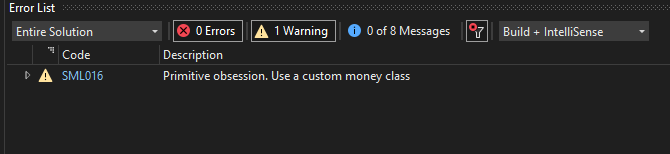
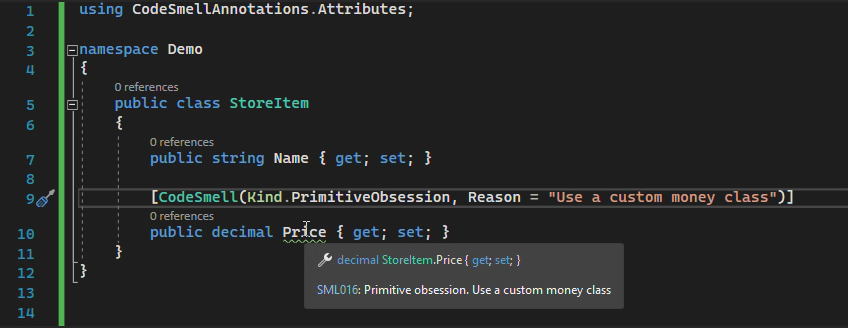

# CodeSmellAnnotations

[](https://github.com/rsvilenov/CodeSmellAnnotations/actions/workflows/dotnet.yml) [](https://www.gnu.org/licenses/lgpl-3.0.en.html)   [](https://www.nuget.org/packages/CodeSmellAnnotations/)

## Annotate your codebase with hard-to-ignore code quality remarks.

> netstandard2.0 compliant

### Table of Contents  

- [General](#General)
- [Installation](#Installation)
- [Usage](#Usage)


### General

How many times have we spotted a code smell but didn't have enough time to fix it right away?
Then what do we do? Add a comment, hoping that some day we or somebody else will see this comment and get into fixing the smell? 

Well, that just never happens.

With this library we can add code smell annotations that will appear as warnings in our build as well as in the IDE.
These warnings will bug us and our collegues until someone fixes them.

Key features:
  * Attributes to annotate the code, which get picked by the compiler.
  * A number of predefined common code smells, allowing for quick annotation of bad code.

### Installation

You can view the [package page on NuGet](https://www.nuget.org/packages/CodeSmellAnnotations/).

To install `CodeSmellAnnotations`, run the following command in the Package Manager Console:

```
PM> Install-Package CodeSmellAnnotations
```
Or use this command with the .NET CLI:
```
> dotnet add package CodeSmellAnnotations
```
### Usage

* Chose the most appropriate one of the following attributes:

```csharp
[CodeSmell(Kind.[PredefinedSmellType])]
[DuplicateOf("MyDoppleganger")]
[SolidViolation(SolidPrinciple.SingleResponsibility)]
```

* Annotate the code
```csharp
using CodeSmellAnnotations.Attributes;

public class StoreItem
{
    public string Name { get; set; }
    
    [CodeSmell(Kind.PrimitiveObsession, Reason = "use a custom money class")]
    public decimal Price { get; set; }
}
```

* Get a warning during build:



* Navigate to the annotated code by clicking on the warning above:


